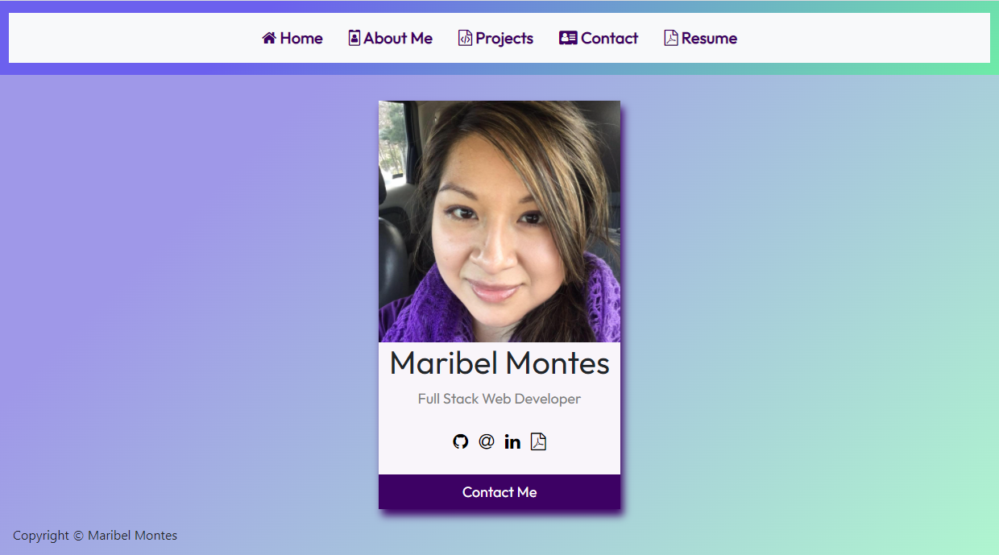
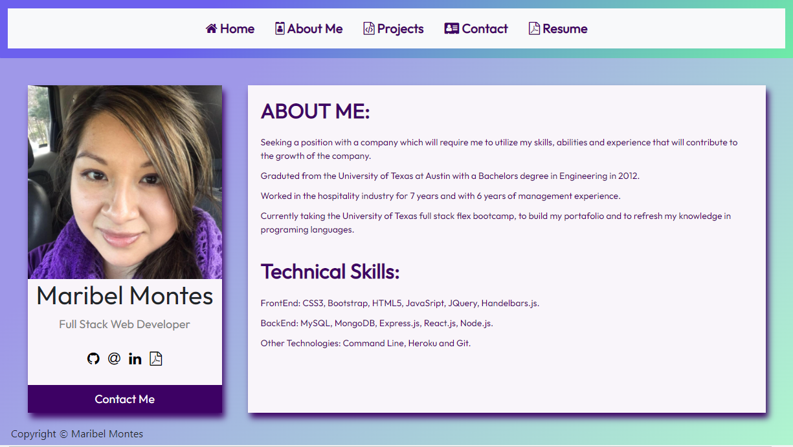
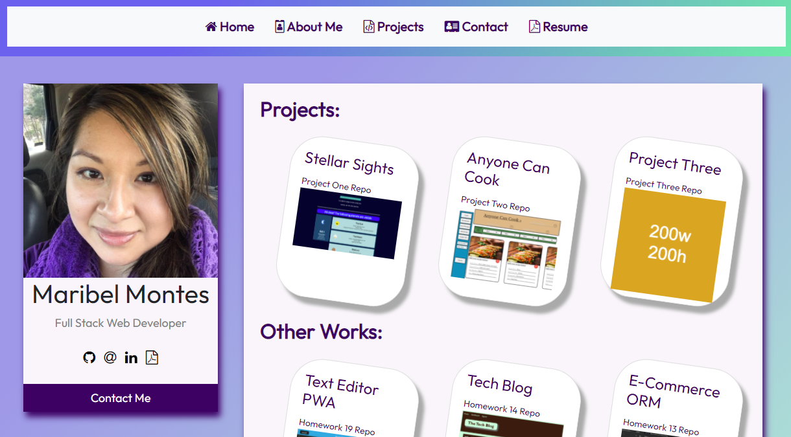
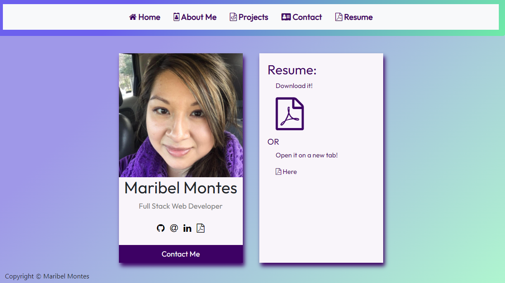

 

# Unit 16: Portafolio v2

## [Description](#description)

In this Homework, I updated my portafolio with the links of the new homeworks I have done so far. I also updated the layout of the page to display each section of the previous portafolio into their own page. 

The page displays a navbar woth Home, About Me, Projects, Contact, Resume, each of these link to a page that display the contents specified on the nabvar link. The Home page displays the main card with my name, and contact information. The contact card displays links to my github, linked in, resume and email. there is also a Contact me buttom that is linked to my email. The next section is the about me, that displays the information about me, and my technical skills. The next part is about the Projects, and this page displays my three main projects. It also displays other homework works I have done so far. The next part is about mmy contact information, this page displays my github, linked in and email information. the last part of the navbar displays my resume page with the option to download my resume or to display it on a new tab. 

### Link to application:

Here is the Link to the deployment of my [portafolio](https://marymd98.github.io/PortafolioV2/).

## Table of Content

* [Description](#description)
* [Installation](#installation)
* [Test](#test)
* [Usage](#usage)
* [License](#license)
* [Contributing](#contributing)
* [Questions](#questions)

## [Installation](#installation)
To initialie, run the following command.

    none, just follow the link displayed on the description.

## [Test](#test)
To run tests, run the following command

    no test at this moment

## [Usage](#usage)

This is my updated portafolio.

### Screenshot of Employee Tracker Comand Lines:

## [License](#license)

## [Contributing](#contributing)

none

## [Questions](#questions)

If you have any questions about the repo, or would like to contact me directly, 
here is my email: maribel.montes4@gmail.com. You can find more of my work at [Maribel Montes](https://github.com/MaryMD98).

